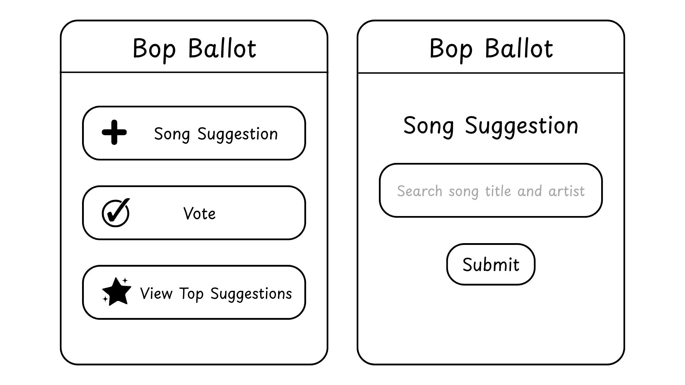
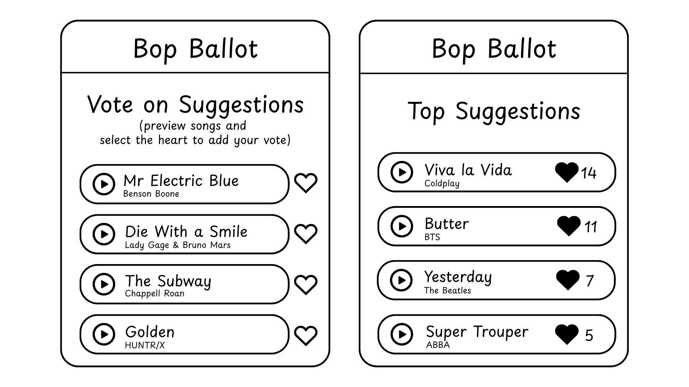

# Bop Ballot

[My Notes](notes.md)

Bop Ballot is a song suggestion app that allows you to give song suggestions, vote on others' suggestions, and view the live voting.


> [!NOTE]
>  This is a template for your startup application. You must modify this `README.md` file for each phase of your development. You only need to fill in the section for each deliverable when that deliverable is submitted in Canvas. Without completing the section for a deliverable, the TA will not know what to look for when grading your submission. Feel free to add additional information to each deliverable description, but make sure you at least have the list of rubric items and a description of what you did for each item.

> [!NOTE]
>  If you are not familiar with Markdown then you should review the [documentation](https://docs.github.com/en/get-started/writing-on-github/getting-started-with-writing-and-formatting-on-github/basic-writing-and-formatting-syntax) before continuing.

## 🚀 Specification Deliverable

> [!NOTE]
>  Fill in this sections as the submission artifact for this deliverable. You can refer to this [example](https://github.com/webprogramming260/startup-example/blob/main/README.md) for inspiration.

For this deliverable I did the following. I checked the box `[x]` and added a description for things I completed.

- [x] Proper use of Markdown
- [x] A concise and compelling elevator pitch
- [x] Description of key features
- [x] Description of how you will use each technology
- [x] One or more rough sketches of your application. Images must be embedded in this file using Markdown image references.

### Elevator pitch

Tired of listening to the same music on repeat? Or frustrated when your music suggestions get ignored? With Bop Ballot, you can make song suggestions, vote on others' suggestions, and view the live voting results all in one place. It's the easiest way to share your favorite music, discover new songs, and create the ultimate crowd-approved playlist.

### Design




### Key features

- Login to keep your suggestions tied to your account
- Make song suggestions by searching for them using the iTunes Search API
- Add votes to others' suggestions
- Play short previews of songs directly in the app
- View real-time updates on which songs have the most votes

### Technologies

I am going to use the required technologies in the following ways.

- **HTML** - HTML pages for login, song search, suggestion list, and voting results
- **CSS** - Consistent and aesthetic color choice and styling throughout the app. Simple and straightforward user interface design.
- **React** - Uses login form, song search, voting, and displaying votes.
- **Service** - Backend service endpoints:
  - login
  - adding a song suggestion
  - submitting song votes
  - retrieving votes
  - Third-party call to iTunes Search API to get song data
- **DB/Login** - Store users, song suggestions, and song vote counts, user votes so that there isn't duplicate voting
- **WebSocket** - Every vote for a song updates the list in real time and broadcast to other users.

## 🚀 AWS deliverable

For this deliverable I did the following. I checked the box `[x]` and added a description for things I completed.

- [x] **Server deployed and accessible with custom domain name** - [My server link](https://boppitybop260.click).

## 🚀 HTML deliverable

For this deliverable I did the following. I checked the box `[x]` and added a description for things I completed.

- [x] **HTML pages** - 4 html pages for login(index.html), making song suggestions(suggest.html), voting(vote.html), and voting results(scores.html).
- [x] **Proper HTML element usage** - I used many HTML elements such as head, nav, menu, li, a, form, label, input, table, img, span, button, and more basic HTML elements.
- [x] **Links** - Each page has a menu at the top with links to direct you to any of the other pages. I also included a link in the footer of each page with my GitHub repo.
- [x] **Text** - Each page has text titles, there are labels for text entries and buttons, there are text descriptions for the song titles and artists and the results table has text entries.
- [x] **3rd party API placeholder** - I have a placeholder for the iTunes API on my suggest.html page and have a placeholder demonstrating sample results from the API.
- [x] **Images** - The song placeholders use images as album covers on the suggest.html and vote.html pages.
- [x] **Login placeholder** - There is a login placeholder on the homepage (index.html).
- [x] **DB data placeholder** - The table in scores.html represents where song suggestions and song vote numbers will be pulled and displayed from the database.
- [x] **WebSocket placeholder** - The vote counts update automatically on scores.html when people click on the heart buttons on vote.html. The vote.html will update with new songs immediately after someone has used suggest.html to suggest a new song.

## 🚀 CSS deliverable

For this deliverable I did the following. I checked the box `[x]` and added a description for things I completed.

- [x] **Header, footer, and main content body** - My main.css includes styling for the header, footer, and main content across all html pages.
- [x] **Navigation elements** - I made the navigation elements/menu in a line across the top right of the page in the header.
- [x] **Responsive to window resizing** - I used display: flex to get my application adjust to different window sizes.
- [x] **Application elements** - Centering the main content on every page, using lots of whitespace, styling to make tables/shapes distinct. 
- [x] **Application text content** - Consistent font use
- [x] **Application images** - I liked the size that my images were already, but I adjust the spacing and placement of them with the text.

## 🚀 React part 1: Routing deliverable

For this deliverable I did the following. I checked the box `[x]` and added a description for things I completed.

- [x] **Bundled using Vite** - I replaced the "scripts" section in package.json with the commands for running Vite.
- [x] **Components** - I created an app.jsx file, and a jsx file for login, suggest, vote, and scores pages.
- [x] **Router** - Routing between login, suggest, voting, and scores components.

```
## 🚀 React part 2: Reactivity

For this deliverable I did the following. I checked the box `[x]` and added a description for things I completed.

- [ ] **All functionality implemented or mocked out** - I did not complete this part of the deliverable.
- [ ] **Hooks** - I did not complete this part of the deliverable.

## 🚀 Service deliverable

For this deliverable I did the following. I checked the box `[x]` and added a description for things I completed.

- [ ] **Node.js/Express HTTP service** - I did not complete this part of the deliverable.
- [ ] **Static middleware for frontend** - I did not complete this part of the deliverable.
- [ ] **Calls to third party endpoints** - I did not complete this part of the deliverable.
- [ ] **Backend service endpoints** - I did not complete this part of the deliverable.
- [ ] **Frontend calls service endpoints** - I did not complete this part of the deliverable.

## 🚀 DB/Login deliverable

For this deliverable I did the following. I checked the box `[x]` and added a description for things I completed.

- [ ] **User registration** - I did not complete this part of the deliverable.
- [ ] **User login and logout** - I did not complete this part of the deliverable.
- [ ] **Stores data in MongoDB** - I did not complete this part of the deliverable.
- [ ] **Stores credentials in MongoDB** - I did not complete this part of the deliverable.
- [ ] **Restricts functionality based on authentication** - I did not complete this part of the deliverable.

## 🚀 WebSocket deliverable

For this deliverable I did the following. I checked the box `[x]` and added a description for things I completed.

- [ ] **Backend listens for WebSocket connection** - I did not complete this part of the deliverable.
- [ ] **Frontend makes WebSocket connection** - I did not complete this part of the deliverable.
- [ ] **Data sent over WebSocket connection** - I did not complete this part of the deliverable.
- [ ] **WebSocket data displayed** - I did not complete this part of the deliverable.
- [ ] **Application is fully functional** - I did not complete this part of the deliverable.
